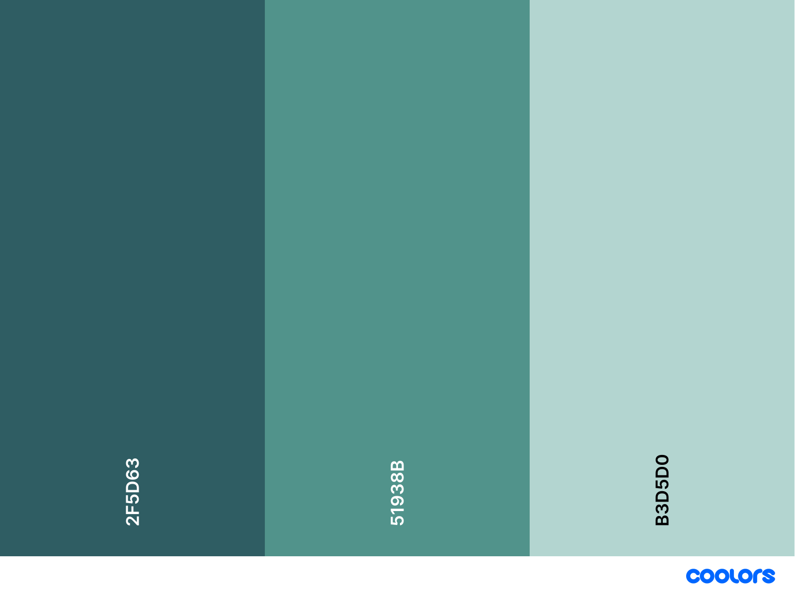

# Overview

  
Table of Contents

  <ol>
      <li>
      <a href="#project-plan">Project Plan</a>
    </li>
        <ul>
            <li>
            <a href="#persona">Persona</a>
            </li>
            <li>
            <a href="#ux-flow">UX Flow</a>
            </li>
            <li>
            <a href="#layout-and-navigation">Layout and Navigation</a>
            </li>
            <li>
            <a href="#entity-relational-database-(erd)">Entity Relational Database (ERD)</a>
            </li>
            <li>
            <a href="#dataflow">Dataflow</a>
            </li>
            <li>
            <a href="#target-audience">Target Audience</a>
            </li>
            <li>
            <a href="#target-screens">Target Screens</a>
            </li>
            <li>
            <a href="#testing-and-deployment">Testing and Deployment</a>
            </li>
            <li>
            <a href="#design-choices">Design Choices</a>
            </li>
        </ul>
    <li>
      <a href="#landing-page-plan">Landing Page Plan</a>
    </li>
    <li>
      <a href="#about-us-page-plan">About Us Page Plan</a>
    </li>
    <li>
      <a href="#organizer-page-plan">Organizer Page Plan</a>
    </li>
    <li>
      <a href="#vendor-page-plan">Vendor Page Plan</a>
    </li>

  </ol>

 

---

# Project Plan

## Persona

**Name:** Vio Vivere\
**Age:** 29 years old\
**Background:**
* A professional event planner who thrives on organizing memorable events and managing intricate details.
* Enjoys bringing visions to life.

**Key Characteristics:**
* Practical and creative
* Seeks easy-to-use and intuitive tools

---

## UX Flow
1. **User Authentication:**
    - **Login/Registration:** Users sign in or register using email and password.
    - **Role Selection:** Users choose between 'Organizer' or 'Vendor'.
    - **Login/SignUp Feedback:** Alerts indicate success or errors in login or signup.

2. **Organizer Workflow:**
   - **Organizer Dashboard:** Show quick stats: Upcoming tasks, guest count, and vendor requests.
   - **Navigation Menu:** Quick links to manage events, tasks, guests, and vendor requests.

3. **Event, Task, and Guest Management (Organizer):**
    - **Create Event:** Organizers input event details.
    - **Manage Events:**
        - Edit or delete events.
    - **Create Task:** Organizers input task details.
    - **Manage Tasks:**
        - Edit or delete tasks.
        - Assign vendors by sending requests via a button with form submission.
        - Mark tasks as complete or pending.
    - **Add Guest:** Organizers input guest details.
    - **Manage Guest:**
        - Edit or delete guest.

4. **Vendor Workflow:**
    - **View Requests:** Vendors see task requests sent by organizers.
    - **Accept/Decline Requests:** Vendors manage requests for a task sent by organizers.

5. **Error Handling & User Feedback**
    - **Validation Alerts:** Ensure fields are correctly filled before submission.
    - **Success Messages:** Confirm actions like event creation, task assignment, and request handling.
    - **Error Messages:** Display issues such as exceeding venue capacity or missing required fields.

---

## Layout and Navigation
* **Navigation Bar (Organizer):**
  + **Dashboard:** Upcoming events and tasks, confirmed guest count, and accepted vendor requests.
  + **Events:** View of events and modals for event management.
  + **Tasks:** View of tasks and modals for task management.
  + **Guests:** View of guests and modals for guest management.
  + **Requests:** View of requests sent to vendors and their status.

* **Navigation Bar (Vendor):**
  + **Dashboard:** View of pending requests from organizers with approval system.
  + **Sidebar:** Vendor name and details.

* **Screen Layouts:**
  + **Dashboard Screen:** Displays tasks and requests of selected event in dropdown.
  + **Events Screen:** View list of events categorized by status (Pending/Completed) and manage events.
  + **Tasks Screen:** View list of tasks categorized by status (Pending/Completed).
  + **Guests Screen:** View list of guests with RSVP status tracking.
  + **Requests Screen:** View and manage vendor requests.

* **Consistent Navigation:**
  + Clear back navigation for seamless movement between screens.
  + Intuitive UI components such as dropdowns, modals, and search filters.
  + Mobile-friendly responsive design for smooth accessibility.

---

## Entity Relational Database (ERD)
1. **Organizer**
   - `_id` (Primary Key)
   - `name`
   - `email`
   - `password`

2. **Vendor**
   - `_id` (Primary Key)
   - `name`
   - `email`
   - `password`
   - `serviceType`
   - `venueDetails`

3. **Guest**
   - `_id` (Primary Key)
   - `eventId` (Foreign Key)
   - `name`
   - `email`
   - `phone`
   - `status`

4. **Event**
   - `_id` (Primary Key)
   - `organizerId` (Foreign Key)
   - `title`
   - `description`
   - `date`
   - `status`
   - `expectedGuests`
   - `guestCount`
   - `venue`

5. **Task**
   - `_id` (Primary Key)
   - `eventId`
   - `title`
   - `description`
   - `dueDate`
   - `status`
   - `vendorId` (Foreign Key)

6. **Request**
   - `_id` (Primary Key)
   - `eventId` (Foreign Key)
   - `taskId` (Foreign Key)
   - `vendorId` (Foreign Key)
   - `status`
---

## Dataflow

### 1. User Authentication (Organizer & Vendor)
- **User Action:** Organizer or vendor logs in via the frontend login modal.
- **Dataflow:**
  - User enters credentials → Frontend sends `POST /api/organizers/login` or `POST /api/vendors/login`
  - Backend verifies credentials in **MongoDB**
  - If valid, backend returns success message & user details → Frontend stores session info (localStorage/sessionStorage).

### 2. Event Creation & Management (Organizer)
- **User Action:** Organizer creates or updates an event.
- **Dataflow:**
  - User fills event form → Frontend sends `POST /api/events`
  - Event is stored in **MongoDB** under the `events` collection
  - Organizer retrieves events using `GET /api/events?organizerId=organizerId`
  - If an event is updated, `PUT /api/events/:id` is triggered.
  - If an event is deleted, `DELETE /api/events/:id` is triggered.
  - Automatic event completion if event date is in the past → `PUT /api/tasks/:id` updates `status: "completed"`

### 3. Task Management (Organizer)
- **User Action:** Organizer adds, updates, deletes, or marks a task as pending or completed.
- **Dataflow:**
  - User creates a task → `POST /api/tasks`
  - Task is stored in `tasks` collection with `eventId` reference
  - User retrieves tasks for an event using `GET /api/tasks/:eventId`
  - Updating or deleting tasks triggers `PUT /api/tasks/:id` or `DELETE /api/tasks/:id`. If a vendor is assigned to a task, the request automatically gets cancelled and deleted.
  - Organizer clicks "Mark as Complete → `PUT /api/tasks/:id` updates `status: "completed"`
  - Organizer clicks "Mark as Pending → `PUT /api/tasks/:id` updates `status: "pending"`
  - Overdue task → `PUT /api/tasks/:id` updates `status: "completed"`

### 4. Assigning Vendors to Tasks (Organizer)
- **User Action:** Organizer assigns a vendor to a task (request-based).
- **Dataflow:**
  - Organizer selects a vendor → `POST /api/requests` (Creates a request)
  - Request is stored in `requests` collection with `status: "pending"`
  - Vendor retrieves their pending requests via `GET /api/requests/vendor/:vendorId`

### 5. Vendor Request Approval (Vendor)
- **User Action:** Vendor accepts or declines a request.
- **Dataflow:**
  - Vendor selects "Accept" → `PUT /api/requests/:requestId/status` (Updates `status: "accepted"`)
  - If accepted, task updates with `assignedVendorId`
  - If declined, `status` is updated to `"declined"`, and organizer can request a vendor again.

### 6. Guest Management (Organizer)
- **User Action:** Organizer adds guests to an event.
- **Dataflow:**
  - Organizer enters guest details → `POST /api/guests`
  - Guest is stored in `guests` collection with `eventId` reference
  - Organizer retrieves guests via `GET /api/guests/:eventId`
  - Guest status updates (`confirmed`, `declined`) trigger `PATCH /api/guests/:id`.

### 7. Venue Selection & Validation (Organizer)
- **User Action:** Organizer selects a venue when requesting a vendor that is a venue manager.
- **Dataflow:**
  - Organizer selects venue manager from dropdown and venue details are shown → `POST /api/requests`.
  - Venue capacity is checked against `expectedGuests`
  - If venue capacity is lower, user will get alerted that the venue cannot accomodate their expected guests for the event. If no problems arise, request successfully gets sent to venue manager.

---

### Summary of API Usage
| **Functionality**         | **HTTP Method** | **API Endpoint**            | **Data Involved** |
|--------------------------|----------------|-----------------------------|------------------|
| User Creation (Organizer)   | `POST`         | `/api/organizers`      | Name, Email, Password |
| User Creation (Vendor)   | `POST`         | `/api/vendors`      | Name, Email, Password |
| User Login (Organizer)   | `POST`         | `/api/organizers/login`      | Email, Password |
| User Login (Vendor)   | `POST`         | `/api/organizers/login`      | Email, Password |
| Create Event | `POST`         | `/api/events`      | Title, Description, Date, Expected Guests |
| Retrieve Event | `GET`         | `/api/events/:id`     | Organizer's Events |
| Update Event   | `PATCH`         | `/api/events/:id`      | Event ID, Title, Description, Date, Expected Guests, Venue, Guest Count |
| Delete Event   | `DELETE`         | `/api/events/:id`      | Event ID |
| Create Task | `POST`         | `/api/tasks`      | Event ID, Title, Description, Due Date |
| Retrieve Tasks For An Event | `GET`         | `/api/tasks/:eventId`      | Event-Specific Tasks |
| Update Task | `PUT`         | `/api/tasks/:id`      | Event ID, Title, Description, Due Date, Status |
| Delete Task | `DELETE`         | `/api/tasks/:id`      | Task ID |
| Request A Vendor For A Task   | `POST`         | `/api/requests`      | Event ID, Task ID, Vendor ID |
| Retrieve Requests by Event with Vendor and Task Details (Organizer)  | `GET`         | `/api/requests/:eventId`      | Event ID, Task-Specific Requests |
| Retrieve Requests for a Vendor with Event, Task, and Organizer Details (Vendor)  | `GET`         | `/api/requests/vendor/:vendorId`      | Vendor-Specific Requests, Event Name, Task Name, Organizer Name and Email, Request Status |
| Accept or Reject Organizer Requests (Vendor)   | `PUT`         | `/api/requests/:requestId/status`      | Request ID, Request Status |
| Delete/Cancel Request (Organizer)  | `DELETE`         | `/api/requests/:requestId`      | Request ID |
| Create Guest | `POST`         | `/api/guests`      | Event ID, Name, Email, Phone Number, Status |
| Retrieve Guests For An Event | `GET`         | `/api/guests/:eventId`      | Event-Specific Guests |
| Update Guest | `PATCH`         | `/api/guests/:guestId`      | Guest ID, Guest Details |
| Delete Guest | `DELETE`         | `/api/guests/:id`      | Guest ID |
| Retrieve Vendor Details  | `GET`         | `/api/vendors`      | Vendor ID, Name, Email, Service Type, Venue Details (If Venue Manager) |
| Update Venue Details (Venue Manager Vendor) | `PUT`         | `/api/vendors/:id/venue`      | Guest ID, Guest Details

---

## Target Audience
<ul>
    <li>Event planners</li>
    <li>Corporate organizers</li>
    <li>Party hosts</li>
</ul>

---

## Target Screens
<ul>
    <li>Desktop (1920x1080)</li>
    <li>Laptop (1440x900)</li>
    <li>Tablet (1024x768)</li>
    <li>Mobile (375x667)</li>
</ul>

---

## Testing & Deployment

Testing:
<ul>
    <li>Proofreading</li>
    <li>Desktop, laptop, tablet, and mobile responsiveness testing</li>
    <li>Browser compatibility</li>
    <li>Accessiblity testing (contrast, text alternatives)</li>
</ul>

Deployment:
<ul>
    <li>Hosting: Github Pages</li>
    <li>Version Control: Git, GitHub</li>
</ul>

---

## Design choices

### Themes
The website has both light and dark themes, the latter being the default.

### Color Scheme

| Hex Code | Description |
| :---: | :---: |
|  #51938b | Primary |
|  #b3d5d0 | Secondary |
|  #2f5d63 | Accent |

### Font Families

| Name | Description | Usage |
| :---: | :---: | :---: |
|  Inter | Primary | Body text
|  DM Serif Text | Secondary | Headings and sub-headings
|  Newsreader | Accent | Navigation bar, emphasis

 

# Landing Page Plan

<b>Purpose:</b> Convert visitors into leads or clients through a strong call to action.

## Page Structure

The landing page will consist of six sections:

<ul>
    <li>Header</li>
    <li>Hero</li>
    <li>Key Features</li>
    <li>Testimonials</li>
    <li>Sign up Form</li>
    <li>Footer</li>
</ul>

---

#### Header Section
This section contains the logo, navigation links, and the theme toggle.

---

#### Hero Section
This section contains the headline and supporting subheadline, along with image snippets of the website's offerings. The call to action button will lead to a sign up form at the bottom of the page.

---

#### Key Features Section
This section contains a card carousel showcasing snippets of the website's services and benefits.

---

#### Testimonials Section
This section contains a card carousel of reviews or testimonials from other clients.

---

#### Sign Up Form Section
This section contains an inviting phrase and the sign up form that the call-to-action button from the hero section will lead to.

---

#### Footer Section
This section contains links to About Us, Services, and Social Links.

---

## Styling
Animations & Effects
    <ul>
        <li>hover effects, transitions</li>
    </ul>

## Features & Functionalities

Event Listeners and DOM Manipulation
    <ul>
        <li>Click events, form validation</li>
    </ul>

Dynamic Content Updates
    <ul>
        <li>localStorage</li>
    </ul>
 

---

# About Us Page Plan

**Purpose:** Provide information about the website and the team behind it.

## Page Structure

The about us page will consist of six sections:

<ul>
    <li>Header</li>
    <li>About Us</li>
    <li>Mission</li>
    <li>Vision</li>
    <li>Our Story</li>
    <li>Who We Are</li>
</ul>

---

#### Header Section
This section contains the logo, navigation links, and the theme toggle.

---

#### About Us Section
This section contains a brief statement about what the team does.

---

#### Mission Section
This section contains the team's purpose and how it can be achieved.

---

#### Vision Section
This section contains the team's aspirations and what they hope to become.

---

#### Our Story Section
This section contains a brief description of how the team and the website came to be.

---

#### Footer Section
This section contains links to About Us, Services, and Social Links.

---

## Styling
Animations & Effects
    <ul>
        <li>Hover effects, transitions</li>
    </ul>

## Features & Functionalities

Event Listeners and DOM Manipulation
    <ul>
        <li>Click events</li>
    </ul>

Dynamic Content Updates
    <ul>
        <li>localStorage</li>
    </ul>
 

# Organizer Page Plan

<b>Purpose:</b> Provide organizers with tools to manage events, tasks, guests, and vendor requests efficiently.

## Page Structure

The organizer page will consist of five main sections:

<ul>
    <li>Header</li>
    <li>Sidebar Navigation</li>
    <li>Dashboard</li>
    <li>Event Management</li>
    <li>Task Management</li>
    <li>Guest Management</li>
    <li>Vendor Requests</li>
</ul>

---

#### Header Section
This section contains the logo, the theme toggle, and a hamburger menu for mobile navigation.

---

#### Sidebar Navigation
This section contains links to navigate between the dashboard, events, tasks, guests, and vendor requests. It also includes a sign-out button.

---

#### Dashboard Section
This section provides an overview of the organizer's activities, including:
- A welcome message with the organizer's name.
- Quick stats for tasks, vendor requests, and guest statuses.

---

#### Event Management Section
This section allows organizers to:
- View a list of events (pending and completed).
- Add new events using a modal form.
- Edit or delete existing events.
- View event details such as title, description, date, venue, and guest count.

---

#### Task Management Section
This section allows organizers to:
- View tasks associated with selected events (pending and completed).
- Add new tasks using a modal form.
- Edit or delete tasks.
- Assign vendors to tasks.

---

#### Guest Management Section
This section allows organizers to:
- View a list of guests for selected events.
- Add new guests using a modal form.
- Edit or delete guest details.
- View guest statuses (confirmed, pending, declined).

---

#### Vendor Requests Section
This section allows organizers to:
- View vendor requests for selected events.
- Cancel pending requests.
- Track the status of vendor requests (pending, accepted, declined).

---

## Styling
Animations & Effects
<ul>
    <li>Hover effects for buttons and links</li>
    <li>Transitions for modals and dropdowns</li>
</ul>

---

## Features & Functionalities

Event Listeners and DOM Manipulation
<ul>
    <li>Click events for buttons and links</li>
    <li>Form validation for adding and editing events, tasks, and guests</li>
    <li>Dynamic updates to tables and dropdowns</li>
</ul>

Dynamic Content Updates
<ul>
    <li>Fetch data from the API to populate tables and dropdowns</li>
    <li>Update the UI in real-time after adding, editing, or deleting items</li>
    <li>Store theme preferences in localStorage</li>
</ul>
 

---

# Vendor Page Plan

<b>Purpose:</b> Provide vendors with tools to manage service requests, update venue details, and track collaborations with organizers.

## Page Structure

The vendor page will consist of four main sections:

<ul>
    <li>Header</li>
    <li>Vendor Info Card</li>
    <li>Requests Section</li>
    <li>Venue Details Modal</li>
</ul>

---

#### Header Section
This section contains:
- The logo.
- A page title ("Dashboard").
- A theme toggle switch for light and dark modes.

---

#### Vendor Info Card
This section displays:
- The vendor's name.
- The vendor's service type (e.g., "Venue Manager").
- Venue details (if applicable), such as name, location, capacity, and amenities.
- An "Edit Venue Details" button for updating venue information.
- A sign-out button to log out of the system.

---

#### Requests Section
This section displays:
- A list of service requests from organizers.
- Each request includes:
  - Event title
  - Task title
  - Organizer's name and email
  - Request status (pending, accepted, or declined)
- Action buttons ("Accept" and "Reject") for pending requests.

---

#### Venue Details Modal
This modal allows vendors to:
- Add or edit venue details, including:
  - Venue name
  - Location
  - Capacity
  - Amenities (comma-separated)
- Save changes or cancel the operation.

---

## Styling
Animations & Effects
<ul>
    <li>Hover effects for buttons and links</li>
    <li>Transitions for modals and dropdowns</li>
</ul>

---

## Features & Functionalities

Event Listeners and DOM Manipulation
<ul>
    <li>Click events for buttons and links</li>
    <li>Form validation for venue details</li>
    <li>Dynamic updates to the requests list</li>
</ul>

Dynamic Content Updates
<ul>
    <li>Fetch vendor data from the API to populate the vendor info card</li>
    <li>Fetch and display service requests dynamically</li>
    <li>Update the UI in real-time after accepting or rejecting requests</li>
    <li>Store theme preferences in localStorage</li>
</ul>
 