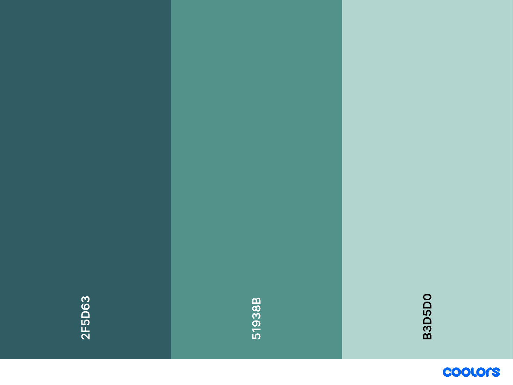

# Overview

  
Table of Contents

  <ol>
      <li>
      <a href="#project-plan">Project Plan</a>
    </li>
        <ul>
            <li>
            <a href="#persona">Persona</a>
            </li>
            <li>
            <a href="#ux-flow">UX Flow</a>
            </li>
            <li>
            <a href="#layout-and-navigation">Layout and Navigation</a>
            </li>
            <li>
            <a href="#target-audience">Target Audience</a>
            </li>
            <li>
            <a href="#target-screens">Target Screens</a>
            </li>
            <li>
            <a href="#testing-and-deployment">Testing and Deployment</a>
            </li>
            <li>
            <a href="#design-choices">Design Choices</a>
            </li>
        </ul>
    <li>
      <a href="#landing-page-plan">Landing Page Plan</a>
    </li>
    <li>
      <a href="#about-us-page-plan">About Us Page Plan</a>
    </li>
        <li>
      <a href="#organizer-page-plan">Organizer Page Plan</a>
    </li>
        <li>
      <a href="#vendor-page-plan">Vendor Page Plan</a>
    </li>

  </ol>

 

---

# Project Plan

## Persona

**Name:** Vio Vivere\
**Age:** 29 years old\
**Background:**
* A professional event planner who thrives on organizing memorable events and managing intricate details.
* Enjoys bringing visions to life.

**Key Characteristics:**
* Practical and creative
* Seeks easy-to-use and intuitive tools

---

## UX Flow
1. **User Authentication:**
   - **Login/Registration:**

2. **Organizer Workflow:**
   - **Organizer Dashboard:** Show quick stats: Upcoming events and tasks, guest count, and accepted vendor requests.
   - **Navigation Menu:** Quick links to manage events, manage tasks, manage guests, and vendor requests.

3. **Vendor Workflow:**
   - **Vendor Dashboard:** Show quick stats: Service requests from organizers and active collaborations.
   - **Approval System:** Show list of pending requests from organizers.

---

## Layout and Navigation
* **Navigation Bar (Organizer):**
  + **Dashboard:** Upcoming events and tasks, guest count, and accepted vendor requests.
  + **Events:** Form for adding new events.
  + **Tasks:** View of tasks and modal task management.
  + **Guests:** View of guests and modal guest management.

* **Navigation Bar (Vendor):**
  + **Dashboard:** Service requests from organizers and active collaborations.
  + **Requests:** View of pending requests from organizers with approval system.

---

## Target Audience
<ul>
    <li>Event planners</li>
    <li>Corporate organizers</li>
    <li>Party hosts</li>
</ul>

---

## Target Screens
<ul>
    <li>Desktop (1920x1080)</li>
    <li>Laptop (1440x900)</li>
    <li>Tablet (1024x768)</li>
    <li>Mobile (375x667)</li>
</ul>

---

## Testing & Deployment

Testing:
<ul>
    <li>Proofreading</li>
    <li>Desktop, laptop, tablet, and mobile responsiveness testing</li>
    <li>Browser compatibility</li>
    <li>Accessiblity testing (contrast, text alternatives)</li>
</ul>

Deployment:
<ul>
    <li>Hosting: Github Pages</li>
    <li>Version Control: Git, GitHub</li>
</ul>

---

## Design choices

### Themes
The website has both light and dark themes, the latter being the default.

### Color Scheme

| Hex Code | Description |
| :---: | :---: |
|  #51938b | Primary |
|  #b3d5d0 | Secondary |
|  #2f5d63 | Accent |

### Font Families

| Name | Description | Usage |
| :---: | :---: | :---: |
|  Inter | Primary | Body text
|  DM Serif Text | Secondary | Headings and sub-headings
|  Newsreader | Accent | Navigation bar, emphasis

 

# Landing Page Plan

<b>Purpose:</b> Convert visitors into leads or clients through a strong call to action.

## Page Structure

The landing page will consist of six sections:

<ul>
    <li>Header</li>
    <li>Hero</li>
    <li>Key Features</li>
    <li>Testimonials</li>
    <li>Sign up Form</li>
    <li>Footer</li>
</ul>

---

#### Header Section
This section contains the logo, navigation links, and the theme toggle.

---

#### Hero Section
This section contains the headline and supporting subheadline, along with image snippets of the website's offerings. The call to action button will lead to a sign up form at the bottom of the page.

---

#### Key Features Section
This section contains a card carousel showcasing snippets of the website's services and benefits.

---

#### Testimonials Section
This section contains a card carousel of reviews or testimonials from other clients.

---

#### Sign Up Form Section
This section contains an inviting phrase and the sign up form that the call-to-action button from the hero section will lead to.

---

#### Footer Section
This section contains links to About Us, Services, and Social Links.

---

## Styling
Animations & Effects
    <ul>
        <li>hover effects, transitions</li>
    </ul>

## Features & Functionalities

Event Listeners and DOM Manipulation
    <ul>
        <li>Click events, form validation</li>
    </ul>

Dynamic Content Updates
    <ul>
        <li>localStorage</li>
    </ul>
 

---

# About Us Page Plan

**Purpose:** Provide information about the website and the team behind it.

## Page Structure

The about us page will consist of six sections:

<ul>
    <li>Header</li>
    <li>About Us</li>
    <li>Mission</li>
    <li>Vision</li>
    <li>Our Story</li>
    <li>Who We Are</li>
</ul>

---

#### Header Section
This section contains the logo, navigation links, and the theme toggle.

---

#### About Us Section
This section contains a brief statement about what the team does.

---

#### Mission Section
This section contains the team's purpose and how it can be achieved.

---

#### Vision Section
This section contains the team's aspirations and what they hope to become.

---

#### Our Story Section
This section contains a brief description of how the team and the website came to be.

---

#### Footer Section
This section contains links to About Us, Services, and Social Links.

---

## Styling
Animations & Effects
    <ul>
        <li>hover effects, transitions</li>
    </ul>

## Features & Functionalities

Event Listeners and DOM Manipulation
    <ul>
        <li>Click events</li>
    </ul>

Dynamic Content Updates
    <ul>
        <li>localStorage</li>
    </ul>
 
---

# Organizer Page Plan

<b>Purpose:</b> Provide organizers with tools to manage events, tasks, guests, and vendor requests efficiently.

## Page Structure

The organizer page will consist of five main sections:

<ul>
    <li>Header</li>
    <li>Sidebar Navigation</li>
    <li>Dashboard</li>
    <li>Event Management</li>
    <li>Task Management</li>
    <li>Guest Management</li>
    <li>Vendor Requests</li>
</ul>

---

#### Header Section
This section contains the logo, the theme toggle, and a hamburger menu for mobile navigation.

---

#### Sidebar Navigation
This section contains links to navigate between the dashboard, events, tasks, guests, and vendor requests. It also includes a sign-out button.

---

#### Dashboard Section
This section provides an overview of the organizer's activities, including:
- A welcome message with the organizer's name.
- Quick stats for tasks, vendor requests, and guest statuses.

---

#### Event Management Section
This section allows organizers to:
- View a list of events (pending and completed).
- Add new events using a modal form.
- Edit or delete existing events.
- View event details such as title, description, date, venue, and guest count.

---

#### Task Management Section
This section allows organizers to:
- View tasks associated with selected events (pending and completed).
- Add new tasks using a modal form.
- Edit or delete tasks.
- Assign vendors to tasks.

---

#### Guest Management Section
This section allows organizers to:
- View a list of guests for selected events.
- Add new guests using a modal form.
- Edit or delete guest details.
- View guest statuses (confirmed, pending, declined).

---

#### Vendor Requests Section
This section allows organizers to:
- View vendor requests for selected events.
- Cancel pending requests.
- Track the status of vendor requests (pending, accepted, declined).

---

## Styling
Animations & Effects
<ul>
    <li>Hover effects for buttons and links</li>
    <li>Transitions for modals and dropdowns</li>
</ul>

---

## Features & Functionalities

Event Listeners and DOM Manipulation
<ul>
    <li>Click events for buttons and links</li>
    <li>Form validation for adding and editing events, tasks, and guests</li>
    <li>Dynamic updates to tables and dropdowns</li>
</ul>

Dynamic Content Updates
<ul>
    <li>Fetch data from the API to populate tables and dropdowns</li>
    <li>Update the UI in real-time after adding, editing, or deleting items</li>
    <li>Store theme preferences in localStorage</li>
</ul>
 

---

# Vendor Page Plan

<b>Purpose:</b> Provide vendors with tools to manage service requests, update venue details, and track collaborations with organizers.

## Page Structure

The vendor page will consist of four main sections:

<ul>
    <li>Header</li>
    <li>Vendor Info Card</li>
    <li>Requests Section</li>
    <li>Venue Details Modal</li>
</ul>

---

#### Header Section
This section contains:
- The logo.
- A page title ("Dashboard").
- A theme toggle switch for light and dark modes.

---

#### Vendor Info Card
This section displays:
- The vendor's name.
- The vendor's service type (e.g., "Venue Manager").
- Venue details (if applicable), such as name, location, capacity, and amenities.
- An "Edit Venue Details" button for updating venue information.
- A sign-out button to log out of the system.

---

#### Requests Section
This section displays:
- A list of service requests from organizers.
- Each request includes:
  - Event title
  - Task title
  - Organizer's name and email
  - Request status (pending, accepted, or declined)
- Action buttons ("Accept" and "Reject") for pending requests.

---

#### Venue Details Modal
This modal allows vendors to:
- Add or edit venue details, including:
  - Venue name
  - Location
  - Capacity
  - Amenities (comma-separated)
- Save changes or cancel the operation.

---

## Styling
Animations & Effects
<ul>
    <li>Hover effects for buttons and links</li>
    <li>Transitions for modals and dropdowns</li>
</ul>

---

## Features & Functionalities

Event Listeners and DOM Manipulation
<ul>
    <li>Click events for buttons and links</li>
    <li>Form validation for venue details</li>
    <li>Dynamic updates to the requests list</li>
</ul>

Dynamic Content Updates
<ul>
    <li>Fetch vendor data from the API to populate the vendor info card</li>
    <li>Fetch and display service requests dynamically</li>
    <li>Update the UI in real-time after accepting or rejecting requests</li>
    <li>Store theme preferences in localStorage</li>
</ul>
 

---